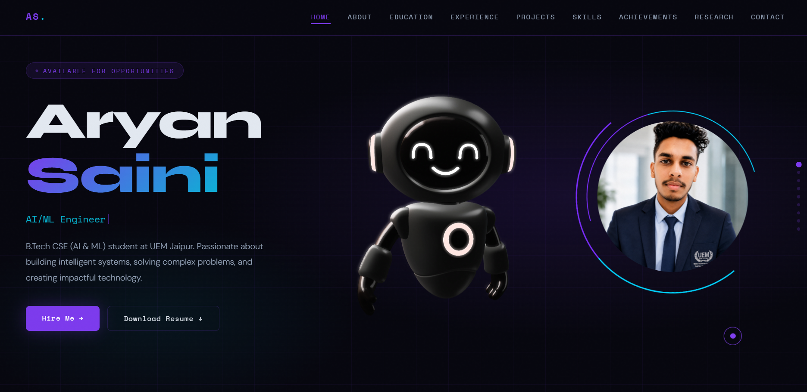
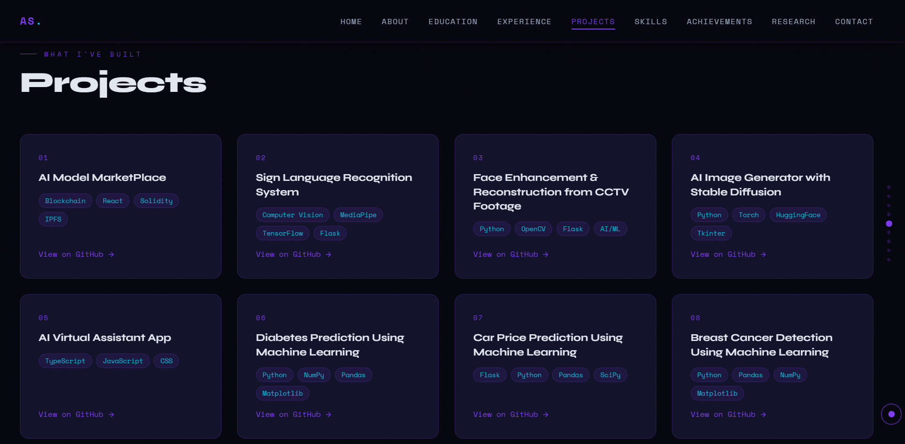

# 🚀 Aryan Saini Portfolio

🌐 **Live Portfolio:** https://portfolio-aryansaini.vercel.app/

---

# 🏠 Portfolio Preview

## Home Page



## Portfolio Overview



---

# 👨‍💻 About Me

Hi, I'm **Aryan Saini**, a passionate **Software Developer, AI/ML Engineer, Python Developer, and Full Stack Developer** currently pursuing **B.Tech in Computer Science Engineering (Artificial Intelligence & Machine Learning)** at the **University of Engineering & Management, Jaipur**.

I enjoy building intelligent systems, developing scalable software, and solving real-world problems through Artificial Intelligence, Machine Learning, Blockchain, and Web Development.

---

# ✨ Features

- Modern Futuristic UI
- Fully Responsive Design
- Interactive 3D Animations
- Animated Hero Section
- AI/ML Focused Portfolio
- Education Timeline
- Experience Timeline
- Project Showcase
- Research Publication
- Skills Visualization
- EmailJS Contact Form
- Resume Download
- Google Maps Integration

---

# 🛠 Tech Stack

## Frontend

- HTML5
- CSS3
- JavaScript

## Libraries & Services

- Typed.js
- EmailJS
- Spline 3D

## Tools

- Git
- GitHub
- VS Code
- Vercel

---

# 🎓 Education

## Bachelor of Technology (CSE - AI & ML)

**University of Engineering & Management, Jaipur**

📅 2023 – 2027

📊 CGPA: **8.4**

---

# 💼 Internship Experience

### Software Development Intern

**Anethix Labs Private Limited**

---

### Machine Learning Intern

**Auspify Technologies**

---

### Python Programming Intern

**AICTE Oasis Infobyte**

---

### AI/ML Virtual Intern

**AWS Academy × EduSkills**

---

### Android Developer Virtual Intern

**Google for Developers × EduSkills**

---

### Content Writing Intern

**InAmigos Foundation**

---

# 🚀 Projects

## AI Model Marketplace

**React • Express.js • Solidity • IPFS**

A decentralized AI marketplace for secure AI model sharing using blockchain technology.

---

## Face Enhancement & Reconstruction from CCTV Footage

**Python • OpenCV • Flask • AI/ML**

AI-powered image enhancement and reconstruction system for low-quality CCTV footage.

---

## AI Image Generator with Stable Diffusion

**Python • PyTorch • Hugging Face**

Generate AI images from text prompts using Stable Diffusion.

---

## AI Virtual Assistant

**JavaScript • HTML • CSS**

Voice-enabled AI assistant for performing everyday tasks.

---

## Diabetes Prediction

**Python • Machine Learning**

Prediction model using supervised learning algorithms.

---

## Car Price Prediction

**Python • Flask • Pandas**

Regression model for estimating car prices.

---

## Breast Cancer Detection

**Python • Machine Learning**

Classification model for breast cancer diagnosis.

---

## Weather Dashboard

**HTML • CSS • JavaScript**

Responsive weather application using weather APIs.

---

# 📄 Research Publication

## Provenance Tracking, Universal Scoring, and Token-Based Incentive Mechanism Enabled AI Model Marketplace

Research Areas

- Artificial Intelligence
- Blockchain
- Decentralized AI Marketplace
- Provenance Tracking
- Universal Scoring
- Token-Based Incentive Mechanism

---

# 📂 Project Structure

```text
Portfolio-Aryansaini/
│
├── index.html
├── README.md
│
├── assets/
│   ├── css/
│   ├── js/
│   ├── img/
│   │     └── Photo AS.png
│   ├── pdf/
│   │     └── Resume Aryan Saini.pdf
│   ├── portfolio-home.png
│   └── portfolio-projects.png
```

---

# ⚙️ Installation

```bash
git clone https://github.com/Aryan132005/Portfolio-Aryansaini.git
```

```bash
cd Portfolio-Aryansaini
```

Run using Live Server

or simply open

```text
index.html
```

---

# 📫 Connect With Me

📧 Email

aryansaini132005@gmail.com

🌐 Portfolio

https://aryansaini-portfolio.vercel.app/

🐙 GitHub

https://github.com/Aryan132005

💼 LinkedIn

https://linkedin.com/in/aryan-saini-3618472a1

📍 Jaipur, Rajasthan, India

---

# ⭐ Support

If you like this project, please consider giving it a ⭐ on GitHub.

---

<div align="center">

## Made with ❤️ by Aryan Saini

### Software Developer • AI/ML Engineer • Python Developer • Full Stack Developer

</div>